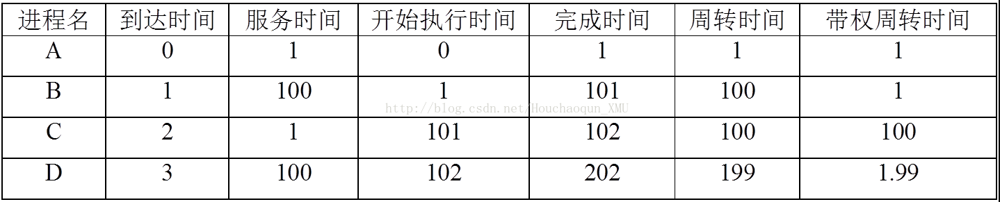
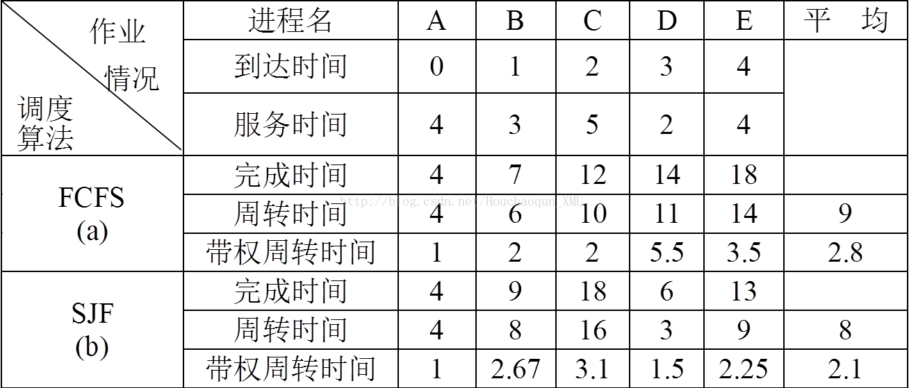

本文记录先来先服务和短作业优先进程调度算法的概念及案例解析。
<!--more-->

# 先来先服务FCFS和短作业优先SJF进程调度算法

## 概念介绍和案例解析

### FCFS调度算法
&emsp; &ensp; 先来先服务(FCFS)调度算法是一种最简单的调度算法，该算法既可用于作业调度，也可用于进程调度。当在作业调度中采用该算法时，每次调度都是从后备作业队列中选择一个或多个最先进入该队列的作业，将它们调入内存，为他们分配资源、创建进程，然后放入就绪队列。在进程调度中使用FCFS算法时，则每次调度是从就绪队列中选择一个最先进入该队列的进程，位置分配处理机，使之投入运行。该进程一直运行到完成或发生某事件而阻塞后才放弃处理机。
在描述过程中，我们会用到一些概念，这里做简单梳理：
* 周转时间 = 作业完成时刻 - 作业到达时间
* 带权周转时间 = 周转时间/服务时间
* 平均周转时间 = 作业总周转时间/作业个数
* 平均带权周转时间带权周转总时间/作业个数

#### 案例解析

##### 案例一
&emsp; &ensp; FCFS算法比较有利于长作业(进程)，而不利于短作业(进程)。下表列出了A、B、C、D四个作业分别到达系统的时间、要求服务的时间、开始执行的时间及各自的完成时间，并计算出各自的周转时间和带权周转时间。&emsp; &ensp; 从上表可以看出，其中短作业C的带权周转时间高达100，这是不能容忍的；而长作业的带权周转时间仅为1.99。据此可知，FCFS调度算法有利于CPU繁忙型作业，而不利于I/O繁忙型作业(进程)。
**CPU繁忙型作业：**指该类作业需要大量的CPU时间进行计算，而很少请求I/O。通常的科学计算属于CPU繁忙型作业。
**I/O繁忙型作业：**指CPU进行处理时需频繁的请求I/O。目前大多数十五处理都属于I/O繁忙型作业。

##### 案例二：采用FCFS调度算法时的调度性能

&emsp; &ensp; 上图表示出有五个进程A、B、C、D、E，它们到达的时间分别是0、1、2、3和4，所要求的服务时间分别是4、3、5、2和4，其完成时间分别是4、7、12、14和18。从每个进程的完成时间中减去其到达时间，即得到其周转时间，进而可以算出每个进程的带权周转时间。

### 短作业优先进程调度算法
&emsp; &ensp; 短作业(进程)优先调度算法SJ(P)F，是指对短作业和短进程优先调度的算法。他们分别作用于作业调度和进程调度。短作业优先(SJF)调度算法是从后备队列中选择一个或若干个估计运行时间最短的作业，将它们调入内存运行。而短进程优先(SPF)调度算法则是从就绪队列中选出一个估计时间最短的进程，将处理机分配给它，使它立即执行并一直执行到完成，或发生某事件而被阻塞放弃处理机时再重新调度。
&emsp; &ensp; 为了和FCFS调度算法进行比较，我们仍利用FCFS算法中所使用的实例，并改用SJ(P)F算法重新调度，再进行性能分析。由上图中的(a)和(b)可以看出，采用SJ(P)F算法后，不论是平均周转时间还是平均带权周转时间，都有较明显的改善，尤其是对短作业D，其周转时间由原来的(用FCFS算法时)11降为3；而平均带权周转时间是从5.5降到1.5。这说明SJF调度算法能有效地降低作业的平均等待时间，提高系统吞吐量。

#### SJ(P)F调度算法的缺点
1. 该算法对称作也不利，如C作业的周转时间由10增至16，其带权时间由2增至3.1。较为严重的情况是，如果有一个长作业(进程)进入系统的后被队列(就绪队列)，由于调度程序总是优先调度那些短作业(进程)，将导致长作业(进程)长期不被调度。
2. 该算法没有考虑作业的紧迫程度，因而不能保证紧迫性作业(进程)会被及时处理掉。
3. 由于作业(进程)的长短是根据用户提供的估计时间而定的，而用户可能有意无意的缩短其作业的估计执行时间，致使该算法不一定能真正的做到短作业优先调度。

## 实验介绍

### 实验问题描述
设计程序模拟进程的先来先服务FCFS和短作业优先SJF调度过程。假设有n个进程分别在T1,… ,Tn时刻到达系统，它们需要的服务时间分别为S1,… ,Sn。分别采用先来先服务FCFS和短作业优先SJF进程调度算法进行调度，计算每个进程的完成时间、周转时间和带权周转时间，并且统计n个进程的平均周转时间和平均带权周转时间。

### 程序要求
* 进程个数n；每个进程的到达时间T1, … ,Tn和服务时间S1, … ,Sn；选择算法1-FCFS，2-SJF。
* 要求采用先来先服务FCFS和短作业优先SJF分别调度进程运行，计算每个进程的周转时间和带权周转时间，并且计算所有进程的平均周转时间和带权平均周转时间。
* 输出：要求模拟整个调度过程，输出每个时刻的进程运行状态，如“时刻3：进程B开始运行”等等。
* 输出：要求输出计算出来的每个进程的周转时间、带权周转时间、所有进程的平均周转时间以及带权平均周转时间。

### 程序设计和开发

#### 程序设计