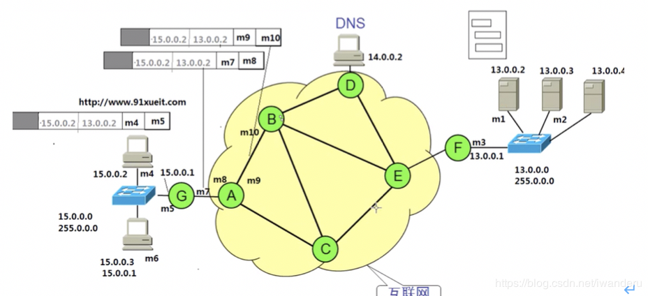
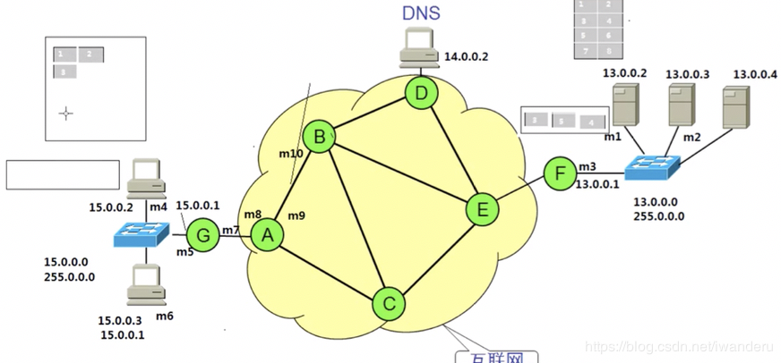

本节总体记述计算机网络相关知识。

<!--more-->

# 计算机网络概述

局域网：覆盖范围小，自己花钱购买设备，带宽固定10M 100M 1000M，自己维护，最远100m
广域网：距离远(>100m)，花钱租带宽
Internet：ISP是电信运营商Internet Service Producer，自己的机房对网民提供访问Internet

**网站的访问：**
 * 帧：数据包包括数据+网站和请求端的IP地址。
 * 后两部分是目标mac地址和原mac地址，即物理地址，传播过程中一直在变化。

**数据的请求：**

**数据的返回：**网页上的数据是一块块发送给请求端的，成功接收后会反馈信息，此时链路中的缓存可以删掉了。数据接收完成后，会拼接恢复网页。

