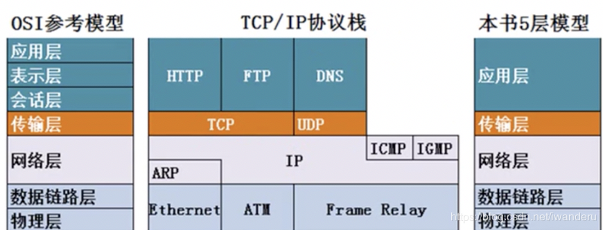
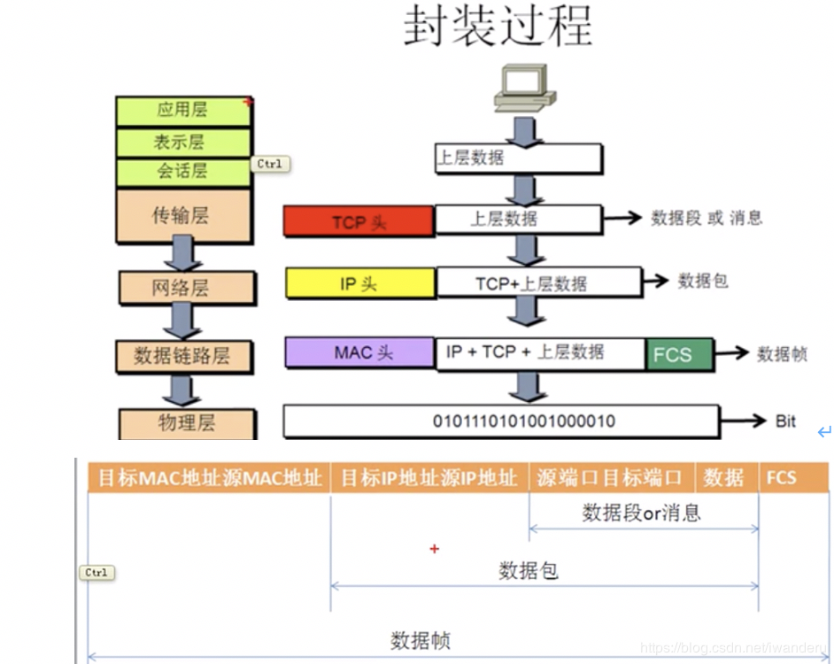

本节总体记述计算机网络相关知识。

<!--more-->

# 计算机网络概述

局域网：覆盖范围小，自己花钱购买设备，带宽固定10M 100M 1000M，自己维护，最远100m
广域网：距离远(>100m)，花钱租带宽
Internet：ISP是电信运营商Internet Service Producer，自己的机房对网民提供访问Internet

**网站的访问：**
 * 帧：数据包包括数据+网站和请求端的IP地址。
 * 后两部分是目标mac地址和原mac地址，即物理地址，传播过程中一直在变化。

**数据的请求：**

**数据的返回：**网页上的数据是一块块发送给请求端的，成功接收后会反馈信息，此时链路中的缓存可以删掉了。数据接收完成后，会拼接恢复网页。

## OSI参考模型

应用层：所有能产生网络流量的程序。
表示层：在传输之前是否进行加密或压缩处理，二进制或ASCII码表示。
 > 表示层出现问题：编码方式不同可以导致（乱码）

会话层：对应，通过查看会话查看木马(netstat -n)，看需求端和网站之间的连接。
传输层：可靠传输，流量控制，不可靠传输（一个数据包即可，不需要建立会话，例如想DNS查询网站IP地址）。
网络层：负责选择最佳路劲，规划IP地址(ipv4和ipv6变化只会影响网络层)。
数据链路层：帧的开始和结束，还有透明传输，差错校验(纠错由传输层解决)。
物理层：定义网络设备接口标准，电器标准(电压)，如何在物理链路上传输的更快。

> 每一层都为上一层提供服务。下一层不通，上一层同样不通。

### OSI参考模型对网络排错的意义
每一层都为上一层提供服务，一旦某一层崩了，上面所有层都会崩，所以排查问题从最上层(物理层)开始排查。

1. 物理层故障怎么办？查看链接状态，查看发送和接收数据包数值。
2. 数据链路层故障怎么办？Mac地址冲突，两个一样的Mac地址同时访问；ADSL(非对称数字用户线路)欠费；两端的接口网速没有协商一致；计算机连接到其他VLAN(虚拟互联网)中。
3. 网络层故障怎么办？配置错误的IP地址，子网掩码，网关；数据有没有通过各个网关到达指定位置。
4. 应用层(合并三层)故障怎么办？应用程序配置问题。

> 网关：出口的地址。
> 

> 传输层：TCP进行可靠传输，UDP进行不可靠传输；

### OSI参考模型和网络安全解决办法
1. 物理层安全隐患？别人能私自接入你的网络，应该拔掉不用的网线或者接口。
2. 数据链路层安全隐患？ADSL账号密码，VLAN，交换机端口绑定Mac地址。
3. 网络层安全隐患？路由器上使用ACL(访问控制列表)控制数据包流量，防火墙设置。
4. 应用层安全隐患？应用程序有没有漏洞。

### 数据封装

**解封装**：计算机在接收到数据帧后，需要去掉为了传输而添加的附加信息，这称为解封装。

## 计算机网络的性能

1. 速率，连接在计算机网络上的主机在数字信道上传送数据位数的速率，也称**data rate**或**bit rate(比特率）**，单位是b/s,kb/s,Mb/s,Gb/s。和正常理解的网速的关系是除以8。
2. 带宽，数据通信领域中，数字信道所能传送的最高数据率，单位是b/s,kb/s,Mb/s,Gb/s。常见的是Mpbs。
3. 吞吐量，在单位时间内通过某个网络的数据量，单位是b/s,Mb/s。
4. 时延，包括发送时延，传播时延，排队时延。发送时延等于数据块长度(bit)除以信道带宽(bit/s)。更快的发送速度意味着波长越短，链路上的数据量更大；更快的传播速度意味着在网线中更快的传播速度。
5. 时延X带宽(时延带宽积),有多少数据**正在***线路上。
6. 往返时间(RTT,Round-Trip Time)，从发送方发送数据开始，到发送方收到接收方确认数据的时间。例如ping一下。
7. 利用率，包括信道利用率：有数据通过的时间/总时间；网络利用率：信道利用率的加权平均；网络当前时延D=网络空闲时时延D0/(1-信道利用率U)。

**参考文献**
* https://www.bilibili.com/video/av9876107?p=7
* https://blog.csdn.net/iwanderu/article/details/103795715