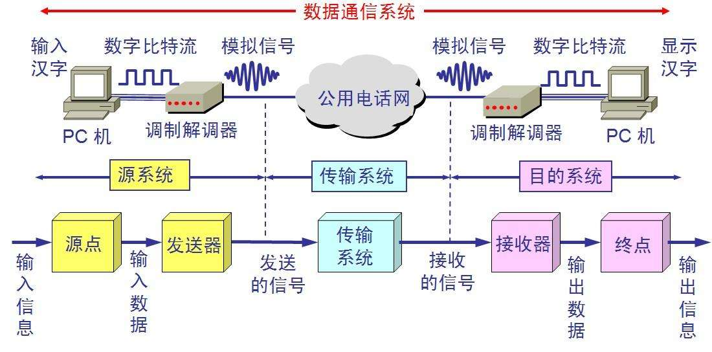

本章学习计算机网络中的物理层相关知识！

<!--more-->

# 物理层

## 物理层定义标准

物理层解决如何在链接各种该计算机的传输媒体上传输比特流，而不是指具体的传输媒体。
物理层的主要任务：确定传输媒体的接口的一些特性，包括
 * 机械特性：指明接口所用接线器的形状和尺寸、引脚数目和排列、固定和锁定装置等等。
 * 电气特性：指明接口电缆的各条线上出现的电压的范围，例如规定电压范围(-5V~5V)。
 * 功能特性：指明某条线上出现的某一电平表示何种意义，例如规定-5V上0，+5V是1。
 * 过程特性：指明对于不同功能的各种可能出现的时间的出现顺序，也称规程特性，规定建立连接时各个相关部件的工作步骤

> 数据在计算机中是并行传输，但在通信线路上是串行传输(经济考虑，逐个比特按照时间顺序传输)，因此物理层还要完成传输方式的转换。

## 数据通信基础知识

### 数据通信系统的模型

模型为两PC经过普通电话线的连线，在经过公用电话网进行通信。

**源系统包括：**
 * **源点**(source，又称源站、信源)：产生要传输的数据，如键盘输入汉字产生输出的数字比特流。
 * **发送器**：数字比特流通过发送器编码才能在传输系统中传输，典型的发送器是解制器。

**目的系统包括：**
 *  **接收器**：把来自传输线路上的模拟信号进行解调，提取出在发送端置入的信息，还原出发送端产生的数字比特流。